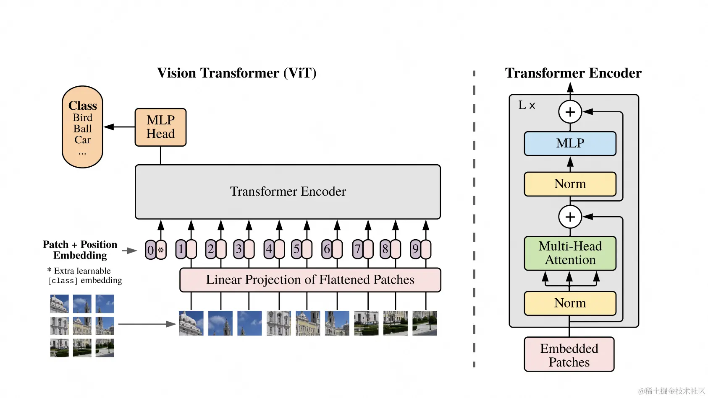

# mnist-vit

vision transformer on mnist dataset

基于mnist手写数字集训练的vision transformer模型，用作学习用途，只能预测0~9

## 模型

1x28x28图片输入，对每个1x4x4区域做conv转成16宽向量，整个图片变为7x7=49个16宽patch向量.

* 所有patch向量做linear转patch embedding
* cls embeeding可学习，直接拼到patch embedding序列头部

**vision transformer**



## 训练

python train.py 

稍微训练一会，loss基本收敛到如下水平：

```
epoch:0 iter:0,loss:0.025252344086766243
```

## 推理

python inference.py

```
正确分类: 5
预测分类: 5
```

